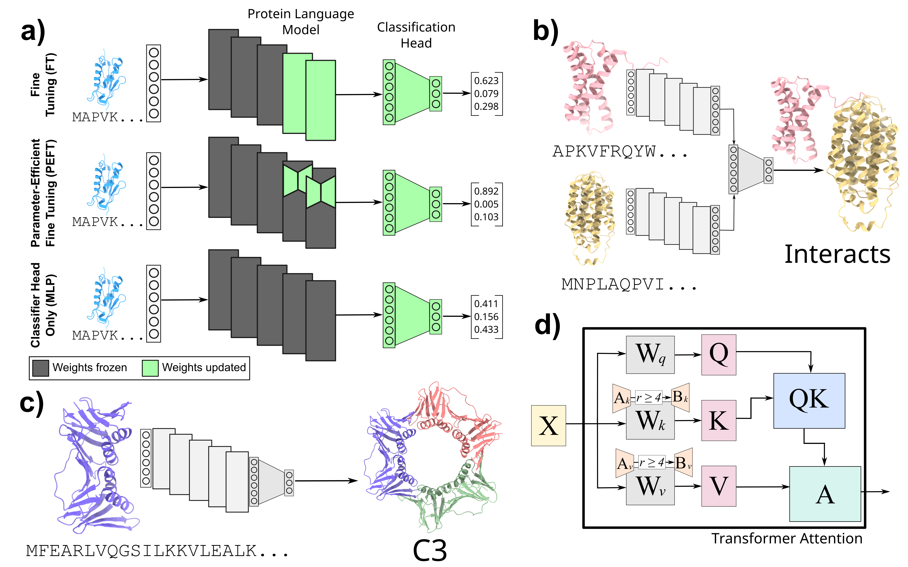

# Democratizing Protein Language Models with Parameter-Efficient Fine-Tuning



🚧🚧 This is a pre-release 🚧🚧

Code from our [manuscript](https://www.biorxiv.org/content/10.1101/2023.11.09.566187v1.full.pdf) on PEFT for protein language models.

## Creating the environment using conda ##
Please use the provided env.yml file to install the required packages in a conda environment

```conda env create -f env.yml```

## Running the code ##
Parameters to run the code, such as train and test mode, LoRA parameters (rank, matrices to adapt), data file paths, data splits etc. are provided in a configuration file. Sample configuration files are provided under ./ppi/config/ and ./symmetry/config

In addition to the configuration file, provide an identifier for your experiment as RUN_NAME and the gpu ids to use as DEVICES

#### Using run_job.sh

```sh run_job_ppi.sh $RUN_NAME $CONFIG $DEVICES```

```sh run_job_symmetry.sh $RUN_NAME $CONFIG $DEVICES```

Example: ```sh run_job.sh ppi_ft_expt ppi/config/config_ppi_finetune.yaml 0```

#### Using python script
```python ppi/main.py --run_name "$RUN_NAME" --config "$CONFIG" --devices "$DEVICES"```
